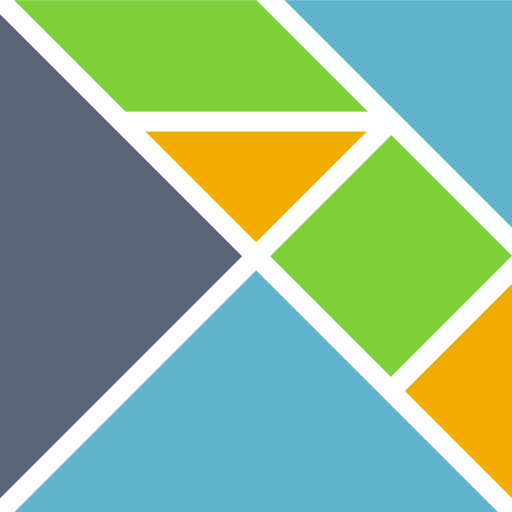

# Try Elm

No runtime errors. Safe and fun refactors!

---

## Katja Mordaunt


Note:

- Senior developer at Neontribe. Been working with web technologies for 10 years - but less computer scientist - more a person who just likes making stuff - and using code to do that.  
- Never thought of myself as a frontend dev - because I can't do visual design - most of my coding experience is in writing backends and APIs in php. But as more and more logic handled in browser - lines are blurring.
- Last year I ended up leading a project that turned out not to need a backend... so I chose Elm

+++

## I like making stuff that helps

IMAGE - piles of help

Note:

- Generally optimistic
- I don't mind who or what it helps as long as the help goes towards lessening the overall help needed in the universe - giving help to bad or giving bad help creates the need for more and more help to be given.

- Learn by doing
- In practice that means - I like to jump right in try first and fail later... then try again

- I @fa[heart] javascript
- It would surprise my colleagues to hear that - So explain The runnnig of javascript - xxx the equality, freedom it creates by a core of universally supported standard on majority of our devices xxx... I do not like reading or writing javascript.

- Believe in open source, open minded
- Collaboration and sharing for progress and inclusion

---

## Assumptions I'm making about you

@ul
- Don't mind having fun
- Value safety & efficiency
- You want your clients' trust to be well earned
- Might think new tech is fun - but old tech is safer
@ulend


Note:

- You might not share the same approah to coding as me.
- Maybe you like to plan a whole structure instead of jumping in.
- But - you probably share some of the same goals...
- START LIST end

---

## This talk will not

@ul
- Teach you functional programming concepts
- Compare Elm with React, Vue and Angular 2.0
- Discuss the newly released Elm 0.19
@ulend

Note:
- Loads of people can do that much better than I can - and one of the awesome things about elm is that you can forget that it's functional. Do first - understand later.
- I won't make excuses or justifications about the size of the Elm community
- Note about 0.19 - some things have changed - but my examples will use 0.18 e.g. elm-lang packages now elm and elm-package.json is now elm.json
- If you are interested in any of those, come and see me later - I can point you towards some resources.


+++

## This talk will

- Shine a little light on Elm and why I enjoy using it

Image sad js dev happy elm dev

---

## Our (fun) problem

Any of these look familiar?


Note:
- Building user interfaces for amazing APIs
- Our tools = code - languages, libraries, frameworks, transpilers, editors/ ides (sadly not lego)

- We're lucky enough to be in a rapidly evolving industry.
- A few years ago we'd have written html, css and a bit of jquery
- Maybe used some templating
- As we asked our browsers to handle interpreting more and more complex code - our code turned to unpredictable, unmaintainable, magic, held together by sticky tape...
- Frameworks started popping up, and build tools and new syntaxes that would make the code easier to use in the way we wanted to - and transpilers.

---?image=elm-lang-home.png&size=auto 32%&position=top

Note:

- Describes itself as: A delightful language for reliable webapps.
- And claims to "Generate JavaScript with great performance and no runtime exceptions." It sounds too good to be true.... but I am going to demonstrate that you can write type safe & functional without a phd in category theory or a lisp in sight.

+++

### A few things to know before we get started...

@ul
- Uses ML style syntax
- Based on functional programming principles
- Statically typed
- Compiles to Javascript
- More than a language, it defines an architecture that helps us write good code
@ulend

Note:
- Elm is a language based on functional programming principles that compiles to Javascript and defines an architecture that makes rapid prototyping, evolving and scaling web apps and maintaining a single source of truth easy.
- Instead of listing the benefits - let's see how it works.

---
## Anatomy of an Elm app

CODE - beginner programme highlight model then update then view

Note:
- model - your 'state'
- update function like a react redux reducer - unidirectional dataflow 
- view - display
- subscriptions for outside events like time but not this example

+++
## Syntax

```elm
"Hello " ++ "Exeter!"
> Hello Exeter!

5 / 2
> 2.5

5 // 2
> 2

addTwoString : Int -> Int -> String
addTwoString x y =
  toString x ++ "+" ++ toString y ++ "=" ++ toString (x + y)

addTwoString 2 3
> "2+3=5"

if True then "yes" else "no"
> "yes"

names = ["Kris", "Rob"]

List.reverse names
> ["Rob", "Kris"]

List.length names
> 2

myFailureTuple = (False, "Oh no!", HomePage)
mySuccessTuple = (True, "Yay!", NextPage)

event = { attendees = 2500, name = "TechExeter Conference" }

event.name
> "TechExeter Conference"

.name event
> "TechExeter Conference"

{ event | attendees = 250 }
> { attendees = 250, name = "TechExeter Conference" }
```

@[1-2](Concatenate strings with `++`)
@[4-8](Division can be floating point / or integer //)
@[10-12](Define a function that takes 2 integers and returns a string)
@[10](The type annotation)
@[11-12](The function definition)
@[14](Call the function)
@[15](The result is a string)
@[17-18](if then else has 2 branches determined by boolean)
@[20-26](Lists must contain items of same type)
@[28-29](Tuples are fixed in number of values but can be mixed types)
@[31](Records are like objects but safe)
@[33-37](Get value with dot or as a function)
@[39-40](Update a record)

Note:
- Double quotes for strings single for characters
- Can't use numbers, strings or Lists as boolean - must be True or False
- No undefined fields. Can't ask for a field not defined. No self or this for recursive records.

+++
## Html?

```
div [ class "list-of-stuff" ]
[
  h2 [] [ text "Short list of stuff"],
  ul []
    [
      li [] [ text "Item one"],
      li [] [ text "Item two"],
      li [] [ text "Item three"]
    ]
]
```

+++
## Html?

```
div [ class "list-of-stuff" ]
[
  h2 [] [ text "Short list of stuff"],
  ul []
    [
      li [] [ text "Item one"],
      li [] [ text "Item two"],
      li [] [ text "Item three"]
    ]
]
```


+++

## Html?

```
div [ class "list-of-stuff" ]
[
  h2 [] [ text "Short list of stuff"],
  ul []
    [
      li [] [ text "Item one"],
      li [] [ text "Item two"],
      li [] [ text "Item three"]
    ]
]
```
@ul
- `button [ onClick DoThing ] [ text "Do thing" ]`
- `a [ href "/my-path" ] [ text "Follow the high road" ]`
- `span [] [ text "...and you can make your own because they are all instances of node"]`
@ulend

Note:
 - and buttons with handlers
 - and links with hrefs
 - and good old spans

+++
## Html?
### Using elm-format

```
div [ class "list-of-stuff" ]
    [ h2 [] [ text "Short list of stuff" ]
    , ul []
        [ li [] [ text "Item one" ]
        , li [] [ text "Item two" ]
        , li [] [ text "Item three" ]
        ]
    ]
```

@ul
- elm-format -> One agreed standard
- Mmachine can parse with confidence
- No one forgets the commas
- Don't need trailing commas to eliminate bad diffs
@ulend

Note:
- I lied a liitle - it looks like this.
- But elm-fromat does that for you... so if it takes your muscle memory a while to retrain - don't worry.
- Like prettier but without the arguments over spaces, tabs and semicolons.
- Elm primarily designed for making UIs so not surprising that there is good support for what we traditionally think of as html elements - in elm they are nodes.


---
## Quick scenario

IMAGE - client with button presser.
ELM coder no problem. JS getting - which framework to choose?

Note: We'll follow the elm project. leave js up to your imagination.

+++
## Awesome brick counter!

```elm
import Html exposing (..)
import Html.Attributes exposing (style)
import Html.events exposing (onClick)

-- MODEL

type alias Model =
    { bricks: Int }

model: Model
model =
    { bricks = 9 }

-- UPDATE

type Msg
    = Reset

update : Msg -> Model -> Model
update msg model =
    case msg of
        Reset ->
          { model | bricks = 0 }

-- VIEW

view : Model -> Html Msg
view model =
    div [ style [("padding-left", "2em")] ]
        [ h1 [] [ text "Hello Exeter!" ]
        , h2 [] [ text "Let's count some bricks" ]
        , div [] [ text (toString model.bricks) ]
        , button [ onClick Reset ] [ text "reset" ]
        ]

main =
  Html.beginnerProgram { model = model, view = view, update = update }

```

@[1-4](Import from libraries and expose only the bits you need)
@[5-11](Our Model)
@[12-19](Our Update functions)
@[20-32](Our View)
@[33-35](The magic!)

+++
## Scenario update!

IMAGE - client wants colour
ELM coder no problem. JS - ummm ok?

Note:
- new feature we hadn't considered - never happens in real lige, right?

+++
## Compiler lead development
### Confident refactor
### 0 runtime error

Note:
- Start by adding new feature in view - follow compiler messages
- Show minor typo example as js runtime error colour vs color
+++
## Scenario update!

IMAGE - client wants better colours - no strings
ELM coder no problem. JS - uh oh!

Note:
- data types change - never happens in real life, right?

+++
## Using union types
### Impossible states impossible 
Note:
- Colour = Colour not Colour = string
- So later when colour changes to tuple with rgb values... compiler will tell us in all the places we used it.

+++
## Easy to expose good API
- we only need the display, not the logic.

---
## Cool things for free
- Easy to get started - tooling elm make and elm reactor
- Create Elm App - webpack
- debugger import/ export
- tiny bundle sizes
- no accidental breaking changes

Note:
- Export history with bug and import into another browser (QA team)
- Trade off between power & what we can know
- Elm package (diff versions to show changes)
- Start small - convert one part of your app to elm and keep building
- enforced semver

---
## Join the Elm community
- Elm town, meetups, slack, discourse, great docs, conferences
- Great for learning - I'm working on a course for primary school children
- Easy for non-programmers - e.g. scientists needing visualisations


[Production code](https://github.co.uk/katjam/elm-pic-story-site)
