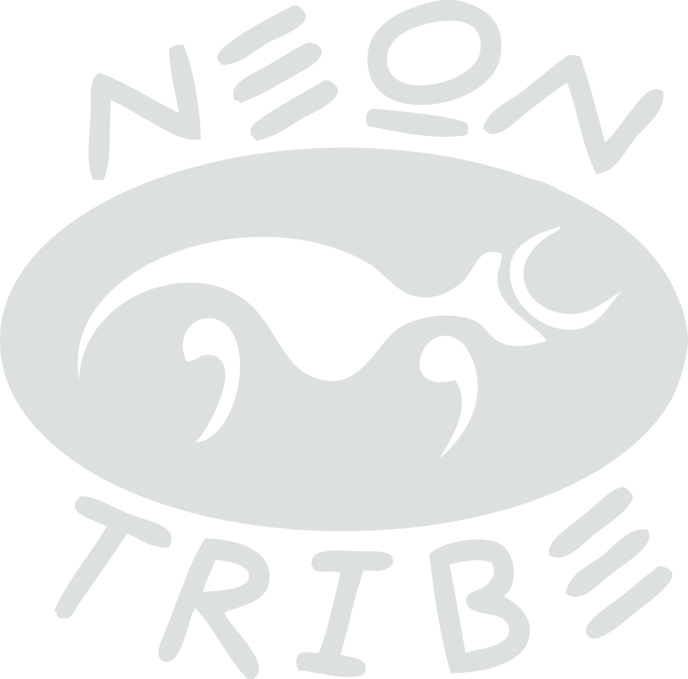
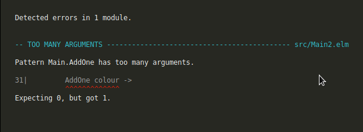

# Try Elm

No runtime errors. Safe and fun refactors!

---

## Katja Mordaunt


Note:

- Senior dev at Neontribe. Working with web tech 10 years - not computer scientist/ engineer
- just like making stuff - use code.  
- Never thought of myself as a frontend dev - because I can't do visual design - most coding in backends and APIs in php.
- Last year I ended up leading a project that turned out not to need a backend... so I chose Elm

+++

## I like making stuff that helps

Note:
- Generally optimistic
- Learn by doing
- In practice that means - I like to jump right try, fail... then try again
- I love javascript
- It would surprise my colleagues to hear that - the running of js - equality, freedom it creates by having a core of universally supported standard on majority of our devices
- I do not like reading or writing javascript

---

## Assumptions I'm making about you

@ul
- Fun
- Safety & efficiency
- Client trust
- New tech = fun vs. Old tech = safe ??
@ulend


Note:

- You might not share the same approah to coding as me.
- Maybe you like to plan a whole structure instead of jumping in.
- But - you probably share some of the same goals...
- START LIST
- Don't mind having fun
- Value safety & efficiency
- You want your clients' trust to be well earned
- Might think new tech is fun - but old tech is safer
- Elm can help with that.

---

## This talk will not

@ul
- Teach you functional programming concepts
- Compare Elm with React, Vue and Angular 2.0
- Discuss the newly released Elm 0.19
@ulend

Note:
- Loads of people teach functional concepts better than I can
- one of the awesome things about elm is that you can forget it's functional
- Do first - understand later. CLICK
- won't make excuses or justifications about the size of the Elm community CLICK
- Note about 0.19 - some things have changed - but my examples will use 0.18
- If you are interested in any of those, come and see me later


+++

## This talk will

- Shine a little light on Elm and why I enjoy using it

Note:
Image sad js dev happy elm dev

---

## Our (fun) problem

Any of these look familiar?


Note:
- Building user interfaces for amazing APIs
- Our tools = code - languages, libraries, frameworks, transpilers, editors/ ides (sadly not lego)
- We're lucky enough to be in a rapidly evolving industry.
- A few years ago we'd have written html, css and a bit of jquery Maybe used some templating
- Then got complicated - our code turned to unpredictable, unmaintainable, magic bits and scary bits we didn't want to touch
- Frameworks started popping up, and build tools and new syntaxes transpilers to help make it easier for us to control

---


Note:

- Describes itself as: A delightful language for reliable webapps.
- And claims to "Generate JavaScript with great performance and no runtime exceptions." It sounds too good to be true.... but I am going to demonstrate that you can write type safe & functional without a phd in category theory or a lisp in sight.

+++


- Uses ML style syntax
- Based on functional programming principles
- Statically typed
- Compiles to Javascript
- More than a language, defines an architecture that helps us write good code

Note:
-XXX Elm is a language based on functional programming principles that compiles to Javascript and defines an architecture that makes rapid prototyping, evolving and scaling web apps and maintaining a single source of truth easy.
- Instead of listing the benefits - let's see how it works.

---
## Anatomy of an Elm app


Note:
- model - your 'state'
- update function like a react redux reducer - unidirectional dataflow 
- view - display
- subscriptions for outside events like time but not this example

+++
## Syntax

```elm
"Hello " ++ "Exeter!"
> Hello Exeter!

5 / 2
> 2.5

5 // 2
> 2

addTwoString : Int -> Int -> String
addTwoString x y =
  toString x ++ "+" ++ toString y ++ "=" ++ toString (x + y)

addTwoString 2 3
> "2+3=5"

if True then "yes" else "no"
> "yes"

names = ["Kris", "Rob"]

List.reverse names
> ["Rob", "Kris"]

List.length names
> 2

myFailureTuple = (False, "Oh no!", HomePage)
mySuccessTuple = (True, "Yay!", NextPage)

event = { attendees = 2500, name = "TechExeter Conference" }

event.name
> "TechExeter Conference"

.name event
> "TechExeter Conference"

{ event | attendees = 250 }
> { attendees = 250, name = "TechExeter Conference" }
```

@[1-2](Concatenate strings with `++`)
@[4-8](Division can be floating point / or integer //)
@[10-12](Define a function that takes 2 integers and returns a string)
@[10](The type annotation)
@[11-12](The function definition)
@[14](Call the function)
@[15](The result is a string)
@[17-18](if then else has 2 branches determined by boolean)
@[20-26](Lists must contain items of same type)
@[28-29](Tuples are fixed in number of values but can be mixed types)
@[31](Records are like objects but safe)
@[33-37](Get value with dot or as a function)
@[39-40](Update a record)

Note:
- Double quotes for strings single for characters
- Can't use numbers, strings or Lists as boolean - must be True or False
- No undefined fields. Can't ask for a field not defined. No self or this for recursive records.

+++
## Html?

```
div [ class "list-of-stuff" ]
[
  h2 [] [ text "Short list of stuff"],
  ul []
    [
      li [] [ text "Item one"],
      li [] [ text "Item two"],
      li [] [ text "Item three"]
    ]
]
```

+++
## Html?

```
div [ class "list-of-stuff" ]
[
  h2 [] [ text "Short list of stuff"],
  ul []
    [
      li [] [ text "Item one"],
      li [] [ text "Item two"],
      li [] [ text "Item three"]
    ]
]
```


+++

## Html?

divs and headings and lists

```
div [ class "list-of-stuff" ]
[
  h2 [] [ text "Short list of stuff"],
  ul []
    [
      li [] [ text "Item one"],
      li [] [ text "Item two"],
      li [] [ text "Item three"]
    ]
]

```
...and buttons and links etc

```
button [ onClick DoThing ] [ text "Do thing" ]
a [ href "/my-path" ] [ text "Follow the high road" ]
```

Note:
- html5 elements fully implemented

+++
## Html?
### Using elm-format

```
div [ class "list-of-stuff" ]
    [ h2 [] [ text "Short list of stuff" ]
    , ul []
        [ li [] [ text "Item one" ]
        , li [] [ text "Item two" ]
        , li [] [ text "Item three" ]
        ]
    ]
```

@ul
- elm-format -> One agreed standard
- Machine can parse with confidence
- No one forgets the commas
- Don't need trailing commas to eliminate bad diffs
@ulend

Note:
- I lied a liitle - it looks like this.
- But elm-fromat does that for you... so if it takes your muscle memory a while to retrain - don't worry.
- Like prettier but without the arguments over spaces, tabs and semicolons.


---
## Quick scenario


Note:
- ELM coder no problem. JS getting - which framework to choose?
- We'll follow the elm project. leave js up to your imagination.

+++
## Awesome brick counter!

```elm
module Main exposing (..)

import Html exposing (..)
import Html.Attributes exposing (class, style)
import Html.events exposing (onClick)

-- MODEL


type alias Model =
    { bricks : Int }


model : Model
model =
    { bricks = 0 }


-- UPDATE


type Msg
    = AddOne
    | Reset


update : Msg -> Model -> Model
update msg model =
    case msg of
        AddOne ->
            { model | bricks = model.bricks + 1 }

        Reset ->
            { model | bricks = 0 }


-- VIEW


view : Model -> Html Msg
view model =
    div []
        [ div [ style [ ( "padding-left", "2em" ) ] ]
            [ h1 [] [ text "Hello Exeter!" ]
            , h2 [] [ text "Let's count some bricks." ]
            , div [] [ text (toString model.bricks) ]
            , button [ onClick AddOne ] [ text "One more!" ]
            , button [ onClick Reset ] [ text "reset" ]
            ]
        ]


main =
    Html.beginnerProgram { model = model, view = view, update = update }

```

@[1-5](Import from libraries and expose only the bits you need)
@[7-16](Our Model)
@[23-35](Our Update functions)
@[39-52](Our View)

+++
## Awesome brick counter!


+++
## Scenario update!


Note:
- ELM coder no problem. JS - ummm ok?
- new feature we hadn't considered - never happens in real life, right?

+++
## Compiler lead development
### Confident refactor. 0 runtime error.

```
module Main exposing (..)

import Color exposing (Color, blue, brown, red)
import Html exposing (Html, button, div, h1, h2, li, text, ul)
import Html.Attributes exposing (class, style)
import Html.Events exposing (onClick)


-- MODEL
type alias Model =
    { bricks : List Color }


model : Model
model =
    {bricks = []}


-- UPDATE


type Msg
    = AddOne
    | Reset


update : Msg -> Model -> Model
update msg model =
    case msg of
        AddOne colour ->
            { model | bricks = colour :: model.bricks }

        Reset ->
            { model | bricks = []}


-- VIEW


view : Model -> Html Msg
view model =
    div []
        [ div [ style [ ( "padding-left", "2em" ) ] ]
            [ h1 [] [ text "Hello Exeter!" ]
            , h2 [] [ text "Let's count some bricks." ]
            , button [ onClick (AddOne red) ] [ text "One more red!" ]
            , button [ onClick (AddOne blue) ] [ text "One more blue!" ]
            , button [ onClick (AddOne brown) ] [ text "One more brown!" ]
            , button [ onClick Reset ] [ text "reset" ]
            , div [] [ text (toString model.bricks) ]
            ]
        ]


main =
    Html.beginnerProgram { model = model, view = view, update = update }

```
@[3](Import Color from core)
@[48-50](Replace old string values with Color values)

Note:
- Start by adding new feature in view - follow compiler messages

+++
## Oops!
### I forgot to add Colour to the update message



+++

## Oops!
### I forgot it's an American Color


Note:
- Yay - compiles! Now I know we're good to go.
+++
## Not the colours you were looking for?


+++
## Using union types

```
module Main exposing (..)

import Html exposing (Html, button, div, h1, h2, li, text, ul)
import Html.Attributes exposing (class, style)
import Html.Events exposing (onClick)


-- MODEL


type Colour
    = StringColor String
    | RgbColor Int Int Int


type alias Model =
    { bricks : List Color }


model : Model
model =
    { bricks = [] }


-- UPDATE


type Msg
    = AddOne Colour
    | Reset


update : Msg -> Model -> Model
update msg model =
    case msg of
        AddOne colour ->
            { model | bricks = colour :: model.bricks }

        Reset ->
            { model | bricks = [] }


-- VIEW


view : Model -> Html Msg
view model =
    div []
        [ div [ style [ ( "padding-left", "2em" ) ] ]
            [ h1 [] [ text "Hello Exeter!" ]
            , h2 [] [ text "Let's count some bricks." ]
            , button [ onClick (AddOne (StringColor "yellowgreen")) ] [ text "One more green!" ]
            , button [ onClick (AddOne (RgbColor 246 235 15)) ] [ text "One more yellow!" ]
            , button [ onClick (AddOne (RgbColor 158 44 145)) ] [ text "One more purple!" ]
            , button [ onClick Reset ] [ text "reset" ]
            , ul [ style [ ( "list-style", "none" ) ] ]
                (List.map makeBrick model.bricks)
            ]
        ]


-- Brick li


makeBrick : Colour -> Html Msg
makeBrick color =
    li
        [ style
            [ ( "background-color", cssColor color )
            , ( "height", "50px" )
            , ( "margin", "8px" )
            , ( "width", "160px" )
            ]
        ]
        []


-- Color to css


cssColor : Colour -> String
cssColor color =
    case color of
        RgbColor r g b ->
            "rgb(" ++ toString r ++ "," ++ toString g ++ "," ++ toString b ++ ")"

        StringColor colorString ->
            colorString


main =
    Html.beginnerProgram { model = model, view = view, update = update }
    
```
@[68-78](Start with getting the bricks right)

+++

## We need to write the cssColor function


+++

```
module Main exposing (..)

import Html exposing (Html, button, div, h1, h2, li, text, ul)
import Html.Attributes exposing (class, style)
import Html.Events exposing (onClick)


-- MODEL


type Colour
    = StringColor String
    | RgbColor Int Int Int


type alias Model =
    { bricks : List Color }


model : Model
model =
    { bricks = [] }


-- UPDATE


type Msg
    = AddOne Colour
    | Reset


update : Msg -> Model -> Model
update msg model =
    case msg of
        AddOne colour ->
            { model | bricks = colour :: model.bricks }

        Reset ->
            { model | bricks = [] }


-- VIEW


view : Model -> Html Msg
view model =
    div []
        [ div [ style [ ( "padding-left", "2em" ) ] ]
            [ h1 [] [ text "Hello Exeter!" ]
            , h2 [] [ text "Let's count some bricks." ]
            , button [ onClick (AddOne (StringColor "yellowgreen")) ] [ text "One more green!" ]
            , button [ onClick (AddOne (RgbColor 246 235 15)) ] [ text "One more yellow!" ]
            , button [ onClick (AddOne (RgbColor 158 44 145)) ] [ text "One more purple!" ]
            , button [ onClick Reset ] [ text "reset" ]
            , ul [ style [ ( "list-style", "none" ) ] ]
                (List.map makeBrick model.bricks)
            ]
        ]


-- Brick li


makeBrick : Colour -> Html Msg
makeBrick color =
    li
        [ style
            [ ( "background-color", cssColor color )
            , ( "height", "50px" )
            , ( "margin", "8px" )
            , ( "width", "160px" )
            ]
        ]
        []


-- Colour to css


cssColor : Colour -> String
cssColor color =
    case color of
        RgbColor r g b ->
            "rgb(" ++ toString r ++ "," ++ toString g ++ "," ++ toString b ++ ")"

        StringColor colorString ->
            colorString


main =
    Html.beginnerProgram { model = model, view = view, update = update }
    

```

@[85-92](Define a function that takes a Colour and outputs String)
@[11-13](Union types are great)

Note:
- A few months later you need support for hex colors
- You don't need to think about which funtions use Color or search them out
- Just add the option to your union type and the compiler will tell you

+++

## Cover the new case everywhere Colour is used


---
## Cool things for free
- Tooling elm-make and elm-reactor or create-elm-app or webpack
- Ellie - live online editor to share and compile code
- debugger import/ export
- tiny bundle sizes
- no accidental breaking changes
- Escape hatches to existing js code and libraries

Note:
- You can build projects how you are used to - or start with elm tools and get more complicated when you need to.
- Share funcitoning code snippets online with Ellie
- Export history with bug and import into another browser (QA team)
- Because 'function level dead code elimination'
- Elm package (diff versions to show changes) - enforced semantic versioning
- Start small - convert one part of your app to elm and keep building - Warning - the js isn't safe

---
## Join the Elm community
- Elm town, meetups, slack, discourse, great docs, conferences
- Great for learning - even for primary school children
- Easy for non-programmers - e.g. scientists needing visualisations
